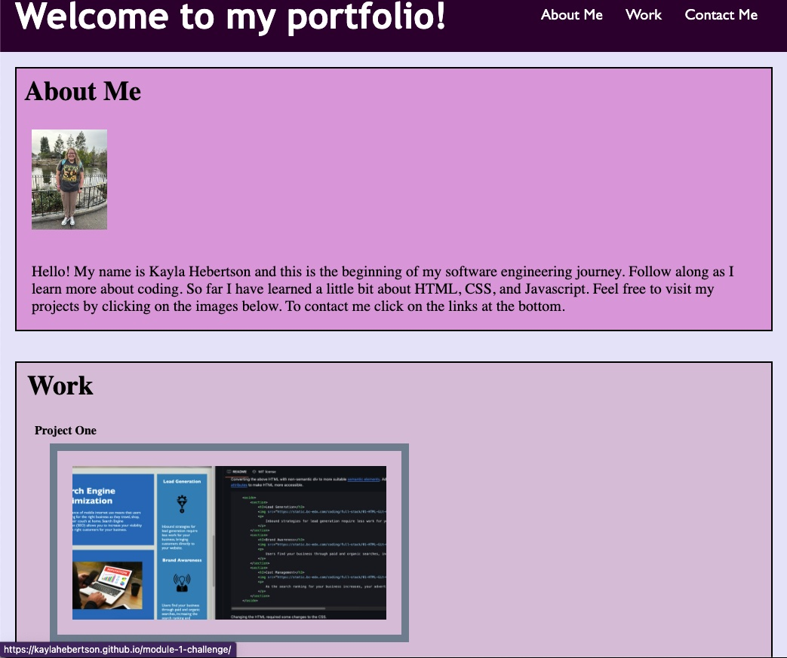

# Module 2 Challenge

## Technology Used

| Technology Used         | Resource URL           | 
| ------------- |:-------------:| 
| HTML    | [https://developer.mozilla.org/en-US/docs/Web/HTML](https://developer.mozilla.org/en-US/docs/Web/HTML) | 
| CSS     | [https://developer.mozilla.org/en-US/docs/Web/CSS](https://developer.mozilla.org/en-US/docs/Web/CSS)      |   
| Git | [https://git-scm.com/](https://git-scm.com/)     |  

## Description

[Visit the Deployed Site](https://kaylahebertson.github.io/module-2-challenge/)

This project was the first step in creating a portfolio where I will be able to showcase all future work and projects I make throughout coding bootcamp and my future jobs. 

Here is a screenshot of what my portfolio looks like now:

```md

```

## Usage

This project is meant to be a foundation for my future portfolio and a way to reflect on how I have grown throughout coding bootcamp.

## Learning Points

I wrote code for an HTML and CSS to create a place where I can show off what I learn. I learned how to create my own portfolio from scratch. I found media queries to be a challenge for me. I am still learning how to use flexbox to my advantage. 

## Author Info

```md
Kayla Hebertson

* [Github](https://github.com/kaylahebertson)
* [LinkedIn](www.linkedin.com/in/kayla-hebertson)
* [Portfolio](https://kaylahebertson.github.io/module-2-challenge/)

```

## Credits

Coding Bootcamp

[W3Schools](https://www.w3schools.com/)

## License 

Please refer to the LICENSE in the repo.
